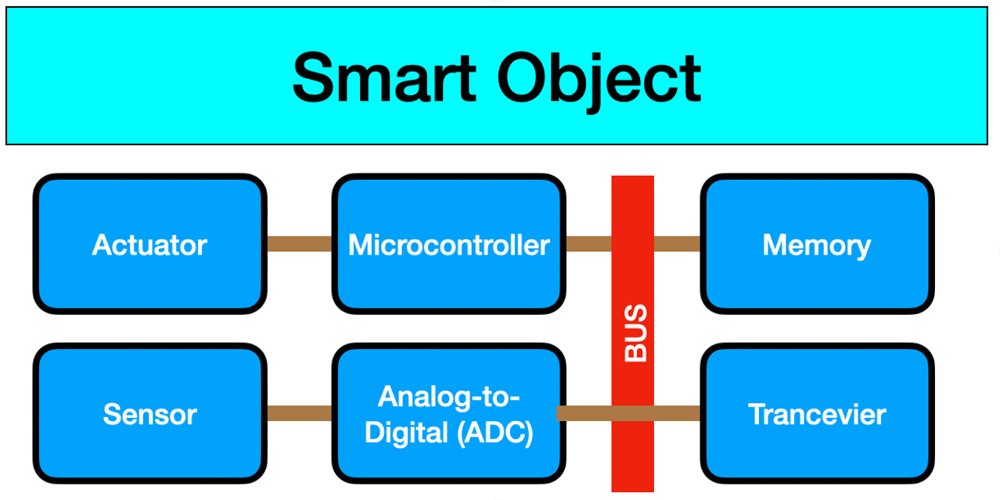

# Internet of Things course

by Chanankorn Jandaeng, Ph.D.

## Introduction of Internet of Things

**what is internet of things**

* The Internet of Things (IoT) is a novel paradigm that is rapidly gaining ground in the scenario of modern wireless telecommunications.
* The basic idea of this concept is the pervasive presence around us of a variety of things or objects through unique addressing schemes, can interact with each other and cooperate with their neighbours to reach common goals
* The **Smart Object** is the key.

**Hardware Components**

* Sensor
  * It is the device that monitor the environment
  * The analog data is transformed to digital data
  * The Micro Electromechanical System (MEMS) is to downsize the sensor device smaller and cheaper

 

more info [click](https://iotgyaan.com/types-of-iot-sensors/)
* Actuator
  * The response when the smart object sense and commit any condition
  * The falling is detected by the accelerator sensor, the red alert is activated
 

* Processing Unit
  * Is to process signal and data
  * Routing data to next node
  * Normally, there are the low power consumption devices
  
  
  
  
  
* Transceiver
  * Is to send and receive data between devices-sensor, device-device
  * The the frequency of wireless module are 868 MHz, 915 MHz, 2.4 GHz
* Power source
  * Most smart object are low power consumption device.
  * Consume power from 2AA battery

