# Internet of Things course

by Chanankorn Jandaeng, Ph.D.

## Introduction of Internet of Things

**Aims** 
* To describe the technologies of Internet of Things
* To explain the applications of Internet of Things
* Can prepare the tools chain for NodeMCU

**what is internet of things**

* The Internet of Things (IoT) is a novel paradigm that is rapidly gaining ground in the scenario of modern wireless telecommunications.
* The basic idea of this concept is the pervasive presence around us of a variety of things or objects through unique addressing schemes, can interact with each other and cooperate with their neighbours to reach common goals
* The **Smart Object** is the key.

[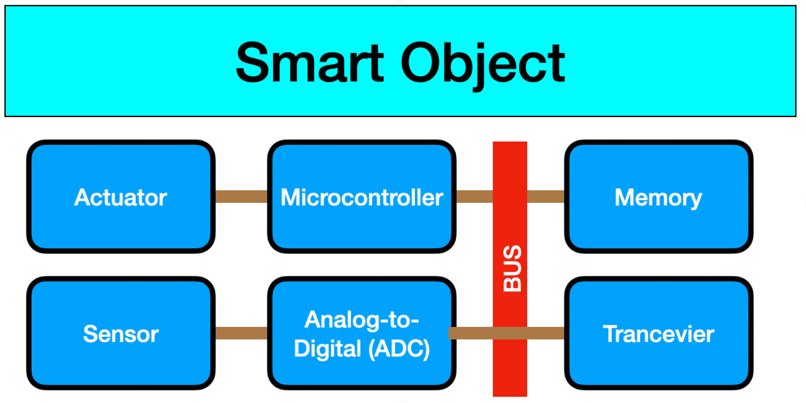](images/01/smart_object.png)

**Hardware Components**

* Sensor
  * It is the device that monitor the environment
  * The analog data is transformed to digital data
  * The Micro Electromechanical System (MEMS) is to downsize the sensor device smaller and cheaper

 

more info [click](https://iotgyaan.com/types-of-iot-sensors/)
* Actuator
  * The response when the smart object sense and commit any condition
  * The falling is detected by the accelerator sensor, the red alert is activated

[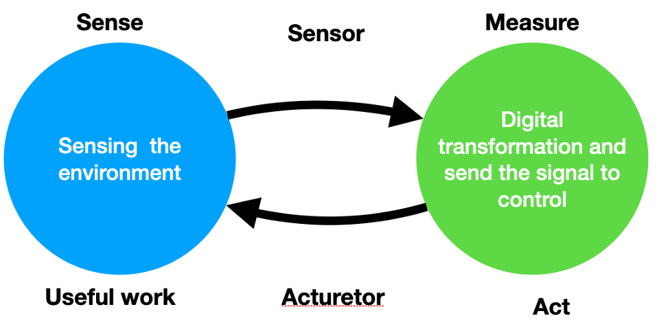](images/01/actuator.png)

* Processing Unit
  * Is to process signal and data
  * Routing data to next node
  * Normally, there are the low power consumption devices

  
  
 
 
  
* Transceiver
  * Is to send and receive data between devices-sensor, device-device
  * The the frequency of wireless module are 868 MHz, 915 MHz, 2.4 GHz

[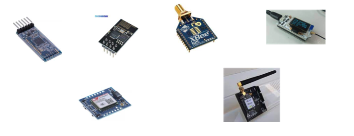](images/01/transceiver.png)

* Power source
  * Most smart object are low power consumption device.
  * Consume power from 2AA battery

**Internet of Things**

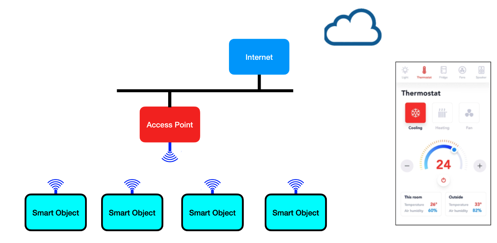

**Key Takeaway**
* The Internet of things is the network of smart objects is to collect data and process them to reach the goals
* Smart object is consisting of processing unit, storage unit, sensor, transmission module.
* Sensor is to sensing and collecting data
* Actuator is to react to the environments
* Processing unit is to control and compute
* Transceiver is wireless transmission
* Power source is a key of processing power
* The components are things, data, process, people

**Microcontroller**
* A microcontroller is a chip optimized to control electronic devices. 
* It is stored in a single integrated circuit which is dedicated to performing a particular task and execute one specific application.
* It is specially designed circuits for embedded applications and is widely used in automatically controlled electronic devices. It contains memory, processor, and programmable I/O.
* Keys:
  * 8/16/32 bit Microcontroller
  * Embedded Microcontroller
  * External memory Microcontroller

**microprocessor**
* A microprocessor is a controlling unit of a micro-computer wrapped inside a small chip. 
* It performs Arithmetic Logical Unit (ALU) operations and communicates with the other devices connected with it. 
* It is a single Integrated Circuit in which several functions are combined.
* Keys:
  * Complex Instruction Set Microprocessors
  * The Application Specific Integrated Circuit
  * Reduced Instruction Set Microprocessors
  * Digital Signal Multiprocessors (DSPs)

| Feature        | Microcontroller           | Microprocessor  |
| ------------- |-------------| -----|
| Definition    | A microcontroller is a single chip integrated circuit (IC) that contains a central processing unit (CPU), memory, and input/output (I/O) peripherals. | A microprocessor is a single chip IC that contains a CPU. |
| Features     | - Contains CPU, memory, and I/O peripherals on a single chip. - Cost-effective. - Low power consumption. - Easy to use.      | - Contains only CPU. - More expensive than microcontrollers. - Consumes more power than microcontrollers. - More difficult to use.|
| Architecture | Microcontrollers typically use the H     |    Microprocessors typically use the von Neumann architecture, where program memory and data memory share the same address space. |
|Application|Microcontrollers are used in embedded systems, such as smart thermostats, smart light bulbs, and smart door locks.|Microprocessors are used in general-purpose computers, such as desktop computers, laptops, and smartphones.|
|Limitation|- Limited memory and processing power. - May not have all of the features needed for complex applications.| - May be too expensive or power-hungry for some applications. - May require additional components to function, such as memory and I/O devices.|

**ESP8266**
* ESP8266 is the WiFi Module the compatible of IEEE802.11 and consists of PIN is for connecting the module. 

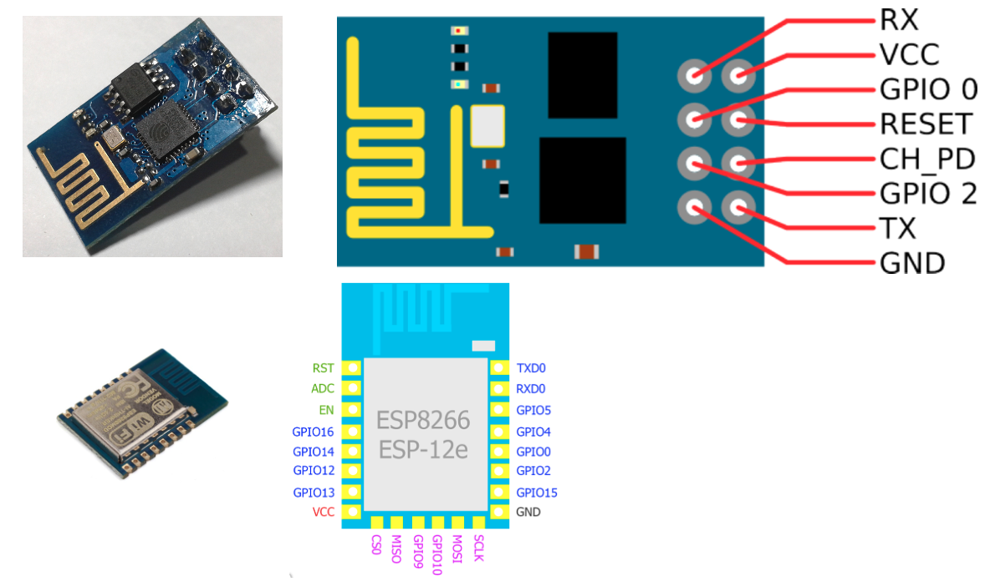

**NodeMCU**

* NodeMCU is an open-source firmware for which open-source prototyping board designs are available. 
* NodeMCU is a low-cost open source IoT platform.
* It initially included firmware which runs on the ESP8266 Wi-Fi SoC from Espressif Systems, and hardware which was based on the ESP-12 module.
*  Later, support for the ESP32 32-bit MCU was added.
* The name "NodeMCU" combines "node" and "MCU" (micro-controller unit).
* The term "NodeMCU" strictly speaking refers to the firmware rather than the associated development kits.

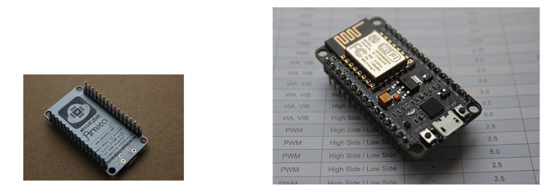

**Pin**

* The general-purpose Input/Output is the pin is connecting the module that do not specifics the function.  
  * represent in the number such as GPIO16.
  * Or, represent in D0 is the digital pin.
  * Accept the A0 is represented in analog signal.

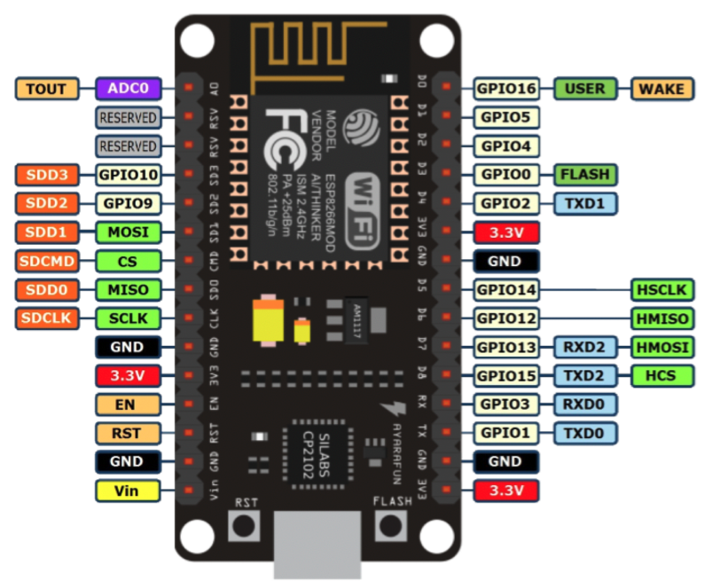

### Workshop

**Toolschain**
* Download “Arduino IDE” from www.arduio.cc, then select the program for your architecture
* https://www.arduino.cc/en/software

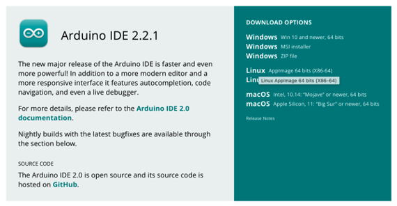

**Setting**

* Select File, then select Preference
* Add [PATH] in Additional Boards Manager URLs, Then select OK
  * https://arduino.esp8266.com/stable/package_esp8266com_index.json

* Install ESP8266  board manager, select Tools —> Boards —> Boards Manager
  * Type “ESP8266” to search the package
* Finally, install

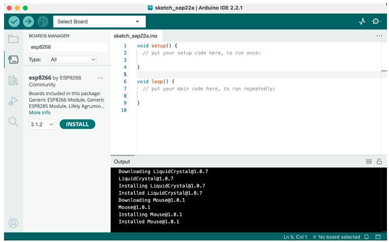

**COM Port**

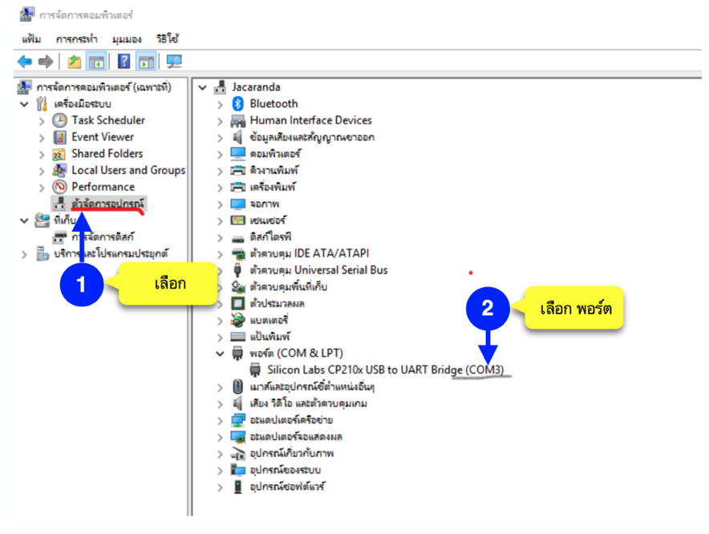

**Select Board**

**Flash program**
* To test, File > Examples > 01.Basics > Blink 

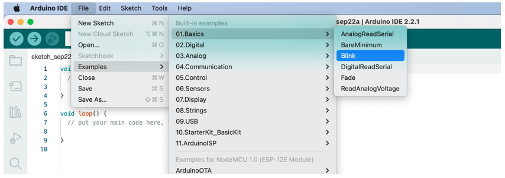

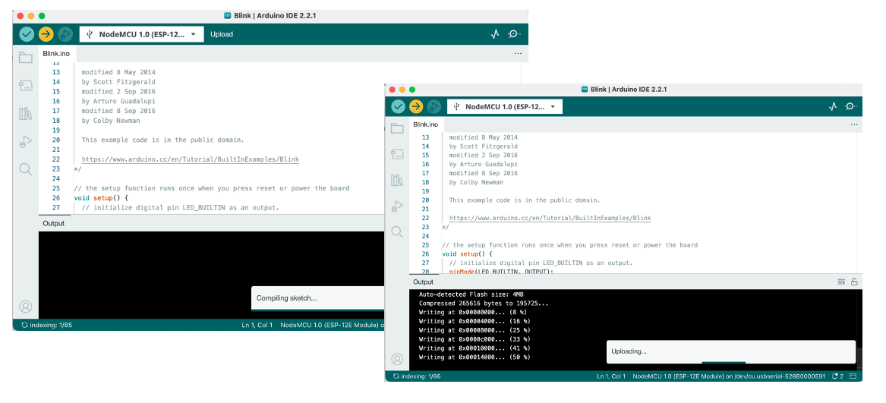
