# Internet of Things course

by Chanankorn Jandaeng, Ph.D.

## Hardware and Interfacing

**Aims**
* To describe the function of analog and digital sensor
* To describe the function of I2C and Serial communication
* To gather the analog and degital value via MCU

**LED**

* Light Emitting Diode (LED) is a semiconductor device that emits light when an electric current passes through it.
* LEDs play a significant role in IoT by providing visual feedback, notifications, and efficient lighting solutions, and they can also be used creatively in various applications to enhance user experience and communication.
* Example blink code in Adruino

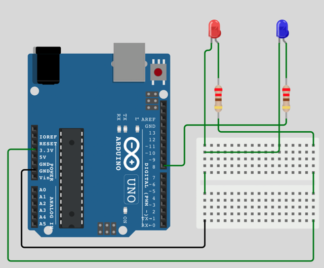

```
void setup() {
  pinMode(8, OUTPUT);
}
void loop() {
  digitalWrite(8, HIGH);
  delay(1000);
  digitalWrite(8, LOW);
  delay(1000);
}
```
* Example blink code in NodeMCU

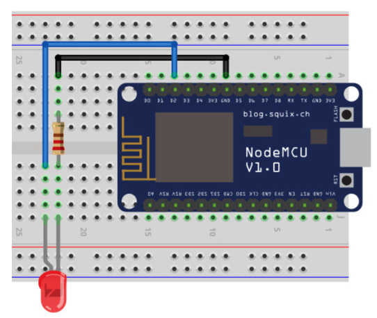

```
void setup() {
  pinMode(D2, OUTPUT);
}
void loop() {
  digitalWrite(D2, HIGH);
  delay(1000);
  digitalWrite(D2, LOW);
  delay(1000);
}
```
**RGB Led**
* Pulse Width Modulation, or PWM, is a technique for getting analog results with digital means. 
* Digital control is used to create a square wave, a signal switched between on and off. 

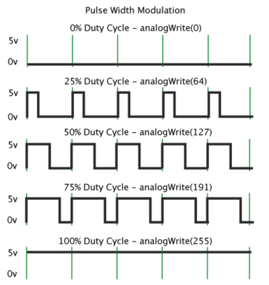

* The RGB LED bulb contains primary LED colors: red, green, and blue.
* It has four pins, including Common pins R, G, and B.
* Common pins connect to the LED color pins A (Anode) or K (Cathode).
* Common A (CA) requires a connection to the positive terminal and a logic 0 (LOW) input to activate the desired color.
* Common K (CK) needs a connection to ground and a logic 0 input to control and illuminate the desired color.

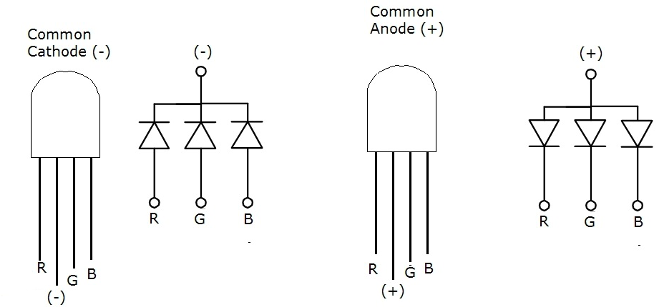

* Example:

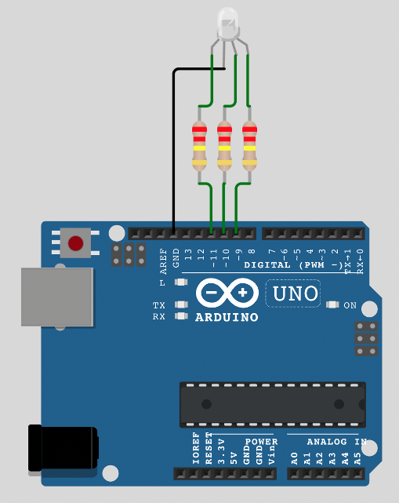

```
int RGBPin[] = {11, 10, 9};

void setup() {
  pinMode(RGBPin[0], OUTPUT);
  pinMode(RGBPin[1], OUTPUT);
  pinMode(RGBPin[2], OUTPUT);
}

void setRGB(int r, int g, int b) {
  analogWrite(RGBPin[0], r);
  analogWrite(RGBPin[1], g);
  analogWrite(RGBPin[2], b);
}

void loop() {
  setRGB(255, 0, 0);
  delay(500);
  setRGB(0,255, 0);
  delay(500);
  setRGB(0, 0, 255);
  delay(500);
}
```

**Analog Interface**

* Analog to Digital Convertor (ADC) is an analog detector reading. and convert analog signal to digital.
* An analog signal is a signal that changes continuously in value and time (Continuous in value and time).
* Therefore, when plotting an analog contract in a graph It will look like a continuous line.
* Whereas a digital signal is a signal that undergoes a stepwise change in value and time (Discrete in value and time).
* Analog signals go through the process of sampling and quantization into digital signals.

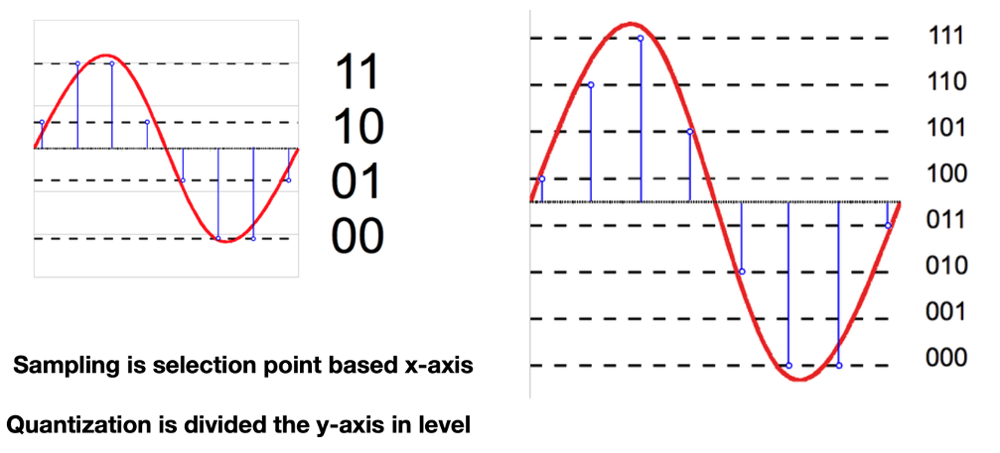

**Volume Resistor or Potentiometer**

* In this experiment, we will simulate an analog signal with voltage from volume Resistor or potentiometer from ADC pin (A0 or Pin 6) of Board NodeMCU/ESP8266. 
* Where the resolution of ADC is 10 bits (1024 values, 0-1023) means that if the voltage readings are analog signals, 3.3 V (equivalent to ESP8266 power supply), converted to digital values.
* The board NodeMCU/ESP8266 is seen as the value 1023 and in the same way. 
* When reading an analog voltage of 0 V, the digital value that the board sees will be 0.
* Example:

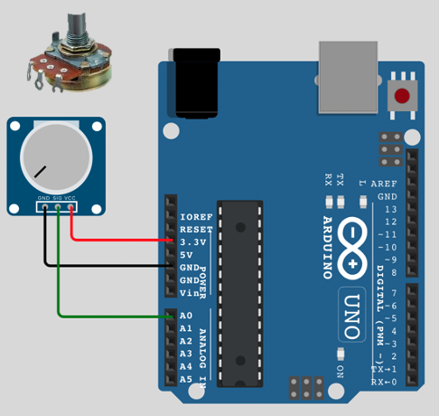

```
void setup() {
  Serial.begin(9600);
}

void loop() {
  int val = analogRead(A0);
  Serial.begin(val);
  delay(100);
}
```
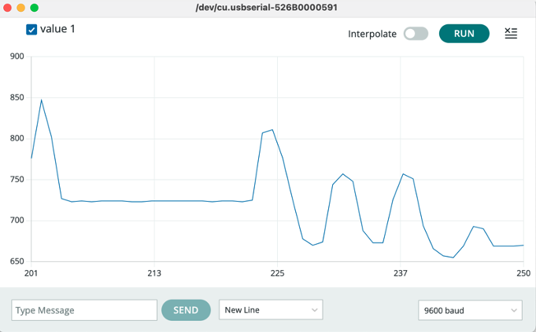

* Challenge your self:

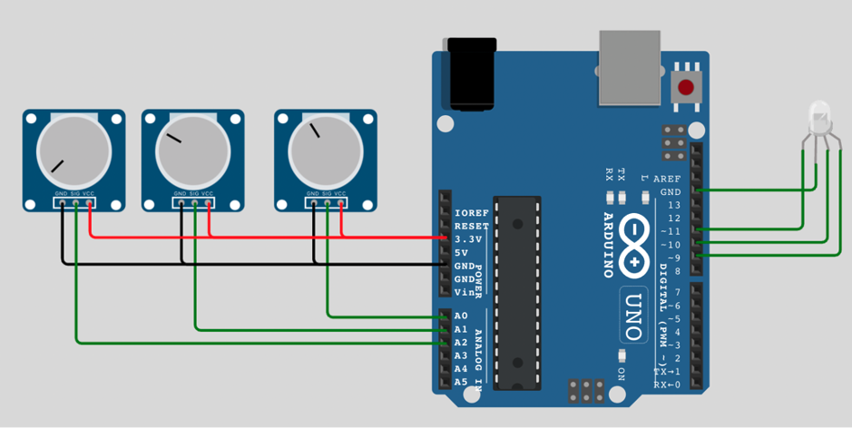

**The Light sensor**

* The Light sensor module comes with the basic components for light detection. 
* Use it to detect the light brightness in your environment and decide to switch OFF or ON light. 
    * Or maybe adjust the brightness of the LED for your house? It comes with digital and analog output. 
* You can adjust the threshold (sensitivity) of the digital output by tuning the onboard variable resistor (potentiometer). 
* Simple usage as it is a digital output, so you will know if the light is presented and decide what to do with it.  
* Example: LDR in analog & digital mode

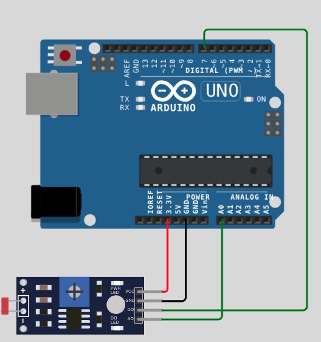

* Example: LDR in  mode

```
void setup() {
  Serial.begin(9600);
  pinMode(7, INPUT);
}

void loop() {
  int d = digitalRead(7);
  int a = analogRead(A0);
  Serial.print(d);  
  Serial.print(" ");  
  Serial.println( a);

  delay(100);
}
```

**DHT11**

* DHT11: Digital Temperature and Humidity Sensor 
    * To monitor temperature and humidity
    * The output is digital signal
    * Consume 3.5 - 5.5 V DC 
    * Temperature in 0-60° c (+/- 2%)
    * Humidity in 20-90 % RH. (+/- 5%)
* Example

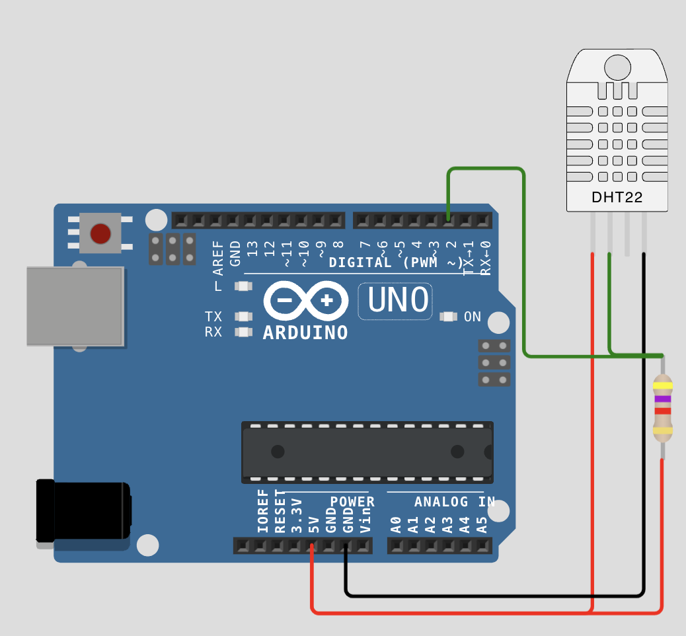

* Add library named DHT11
    * Search DHT11 and install
    * Install -> Install All

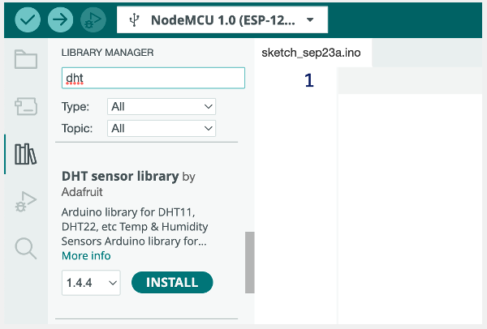

* Code

```
#include "DHT.h"
void setup(){
    Serial.begin(9600);
    Serial.println();
    Serial.println("Status\tHumidity (%)\tTemperature (C)\t(F)");

    dht.setup(2); // data pin 2
}

void loop()
{
    delay(dht.getMinimumSamplingPeriod());

    float humidity = dht.getHumidity(); // ดึงค่าความชื้น
    float temperature = dht.getTemperature(); // ดึงค่าอุณหภูมิ

    Serial.print(dht.getStatusString());
    Serial.print("\t");
    Serial.print(humidity, 1);
    Serial.print("\t\t");
    Serial.print(temperature, 1);
    Serial.print("\t\t");
    Serial.println(dht.toFahrenheit(temperature), 1);
}

```

**I2C**
* Inter-Integrated Circuit (I2C) is the data communication for low-speed communication.
    * Use in microprocessor or microcontroller
    * Compatible many devices in a single bus
        * SDA (Serial Data) :- TX/RX
        * SCL (Serial Clock) :- control

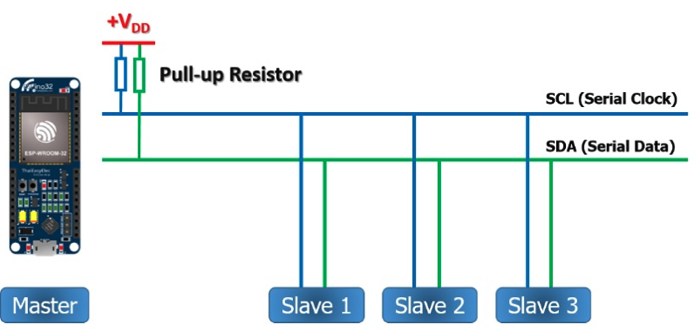

* I2C on NodeMCU

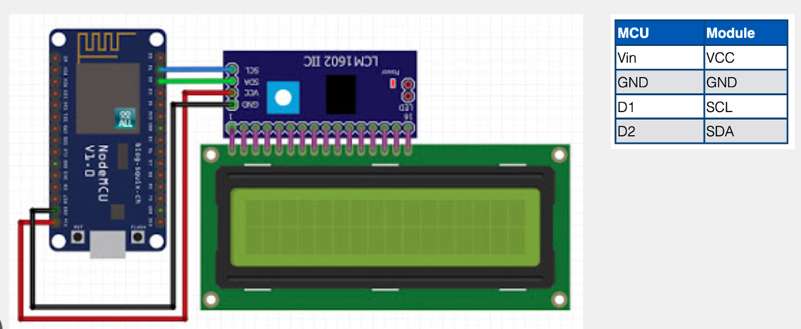

* Add downloaded Library
    * Download: https://github.com/cjundang/IoTWorkshop6Hr/blob/master/Arduino-LiquidCrystal-I2C-library-master.zip 
    * Add to Arduino IDE
        * Select Sketch > Include Library > Add zip Library

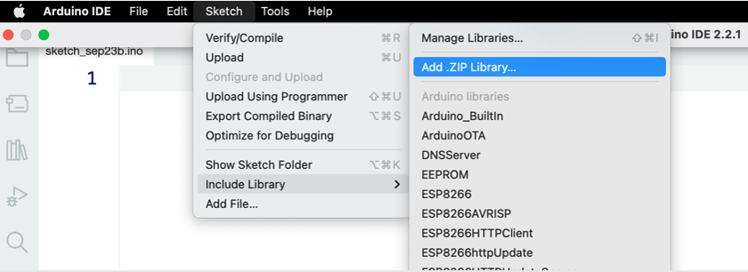

* Code:
```
#include <LiquidCrystal_I2C.h>
#include <Adafruit_Sensor.h>
LiquidCrystal_I2C lcd(0x27,16,2);
void setup(){
  lcd.begin();
  lcd.setCursor(0, 0);
  lcd.print("Hello Word");
  lcd.setCursor(5, 1);
  lcd.print("School of Informarics");
}

void loop(){
}
```
* OLED
    * Add Library
        * Search “adafruit ssd1306”
        * Install ALL library
```
#include <SPI.h>
#include <Wire.h>
#include <Adafruit_GFX.h>
#include <Adafruit_SSD1306.h>

#define OLED_RESET 16
Adafruit_SSD1306 display(OLED_RESET);
void setup() {
    display.begin(SSD1306_SWITCHCAPVCC, 0x3c);  
    display.clearDisplay();  
    display.setTextSize(1);  
    display.setTextColor(WHITE);
    display.setCursor(0,0);  
    display.println("Hello");

    display.setCursor(0,10);
    display.setTextSize(2);
    display.setTextColor(BLACK, WHITE);  
    display.println("World");
    display.display();
}
void loop() {
}
```