# Internet of Things course

by Chanankorn Jandaeng, Ph.D.

## IoT Communication Protocol

**Aims**
* To descibe the characters and limitation of communication techology 
* To implement the server on MCU

### Communication Technology
**Spectrum Usage**

* Spectrum usage refers to the allocation of radio frequency spectrum to different wireless technologies. It is important to manage spectrum usage efficiently to avoid interference between different technologies and to ensure that everyone has access to the spectrum they need.
* The wireless technologies you mentioned use different parts of the radio spectrum. For example:
    * IEEE 802.11ac and IEEE 802.11ah use the 5 GHz band.
    * IEEE 802.15.4 (Zigbee), Bluetooth, and Wi-SUN use the 2.4 GHz band.
    * DASH7 uses the 700 MHz band.
    * 6LoWPAN is a protocol that can be used over any of these bands.
    * LoRa, STRIIJ, and Sigfox use sub-GHz bands, such as 900 MHz and 433 MHz.
*The choice of spectrum band depends on a number of factors, including:
    * The desired range of the technology.
    * The desired data rate.
    * The amount of interference that is likely to be present.
    * The availability of spectrum in a particular region.
* For example, low-power wide-area networks (LPWANs) such as LoRaWAN and Sigfox use sub-GHz bands because they can achieve long range and low power consumption at the expense of data rate. Wi-Fi, on the other hand, uses the 5 GHz band because it can achieve high data rates, but it has shorter range and is more susceptible to interference.
* Spectrum usage is important for all of the wireless technologies you mentioned, but it is especially important for IoT devices. IoT devices often need to communicate over long distances and with low power consumption. The sub-GHz bands are ideal for these applications.

**RFID**

* Non-contact identification: RFID tags can be read and written without the need for physical contact. This makes them ideal for use in harsh environments or where it is difficult or impossible to make contact with a tag, such as on moving objects or in liquids.
* Durability: RFID tags are typically very durable and can withstand harsh environments, such as extreme temperatures, chemicals, and moisture.
* Read/write capability: RFID tags can be either read-only or read/write. Read-only tags can only be read, while read/write tags can be both read and written to. This allows for data to be updated on RFID tags as needed.
* Long read range: RFID tags can be read from a distance of up to several meters, depending on the frequency used and the power of the reader. This makes them ideal for use in applications where it is necessary to read tags from a distance, such as in asset tracking or inventory management.
* Multiple tag reading: RFID readers can read multiple tags simultaneously. This makes them ideal for use in applications where it is necessary to read a large number of tags quickly, such as in baggage handling or access control.

**Bluetooth**
* Wireless communication: Bluetooth enables devices to communicate with each other without the need for wires or cables. This makes it a convenient and versatile technology for a wide range of applications.
* Short-range connectivity: Bluetooth operates over a short range, typically up to 10 meters (33 feet). This makes it ideal for connecting devices that are close together, such as a smartphone and a headset or a laptop and a printer.
* Low power consumption: Bluetooth is a low-power technology, which means that it consumes less energy than other wireless technologies such as Wi-Fi. This makes it a good choice for battery-powered devices.
* Security: Bluetooth features a number of security features that help to protect data from being intercepted or eavesdropped on.
* Ad hoc networking: Bluetooth devices can create ad hoc networks, which means that they can connect to each other directly without the need for a central infrastructure such as a router.
* Support for multiple profiles: Bluetooth supports a wide range of profiles, which are sets of rules that define how devices can communicate with each other. This allows Bluetooth to be used for a variety of applications, such as audio streaming, file transfer, and data synchronization.

**Zigbee**

* Low power consumption: Zigbee is a low-power technology that is ideal for battery-powered devices. This makes it a good choice for applications such as smart home automation, where devices may be infrequently used.
* Mesh networking: Zigbee supports mesh networking, which allows devices to communicate with each other indirectly through other devices. This can extend the range of a Zigbee network and make it more resilient to obstacles.
* Security: Zigbee features a number of security features that help to protect data from being intercepted or eavesdropped on.
* Low cost: Zigbee is a relatively low-cost technology, which makes it a good choice for a wide range of applications.
* Interoperability: Zigbee is a standardized technology, which means that devices from different manufacturers can interoperate with each other.

**WiFi**
* Wireless connectivity: WiFi allows devices to connect to a network without the use of physical cables, providing greater mobility and flexibility.
* High speed: WiFi networks can provide high-speed internet access, allowing users to download and upload data quickly.
* Wide range: WiFi networks can cover a wide range of distances, depending on the type of router and the environment in which it is used.
* Compatibility: WiFi is a widely adopted technology and is compatible with a wide range of devices, including smartphones, laptops, tablets, and smart home devices.
* Security: WiFi networks can be secured using a variety of security mechanisms, such as WPA2 encryption.

**Long Range**
* LoRaWAN
    * Long range: LoRaWAN devices can communicate over long distances, up to several kilometers in rural areas and a few kilometers in urban areas. This makes it ideal for applications where it is necessary to connect devices that are spread out over a large area.
    * Low power consumption: LoRaWAN devices are very energy-efficient, which means that they can operate on batteries for years. This makes them ideal for battery-powered applications such as sensors and remote monitoring devices.
    * Secure: LoRaWAN networks are very secure, using end-to-end encryption to protect data from being intercepted or eavesdropped on.
    * Scalable: LoRaWAN networks can be scaled to support a large number of devices, making them ideal for large-scale IoT deployments.
    * Cost-effective: LoRaWAN devices and networks are relatively inexpensive, making them a cost-effective solution for a wide range of applications.
* NB-IoT
    * Long range: NB-IoT devices can communicate over long distances, up to several kilometers in rural areas and a few kilometers in urban areas. This makes it ideal for applications where it is necessary to connect devices that are spread out over a large area.
    * Low power consumption: NB-IoT devices are very energy-efficient, which means that they can operate on batteries for years. This makes them ideal for battery-powered applications such as sensors and remote monitoring devices.
    * Secure: NB-IoT networks are very secure, using end-to-end encryption to protect data from being intercepted or eavesdropped on.
    * Massive connectivity: NB-IoT networks can support many devices, making them ideal for large-scale IoT deployments.
    * Cost-effective: NB-IoT devices and networks are relatively inexpensive, making them a cost-effective solution for a wide range of applications.


### HTTP Protocol
Hypertext Transfer Protocol (HTTP) เป็น โพรโตคอลที่ใช้เป็นหลักในการเข้าถึงข้อมูลบนเวิลด์ไวด์เว็บ โดย HTTP จะใช้บริการของ TCP ผ่าน wellknown port หมายและ 80  โดยแลกเปลี่ยน HTTP Transaction  การสื่อสารของ HTTP เป็นโพรโตคอลที่ไม่จำสถานะ (Stateless Protocol) แม้ว่ามันจะใช้บริการของ TCP ก็ตาม ซึ่งการสื่อสารทุกครั้งของต้องร้องขอการเชื่อมต่อเครือข่ายก่อนทุกๆ ครั้งซึ่งแตกต่างกับโพรโตคอลที่จำสถานะ หรือ stateful protocol 

HTTP Transaction ระหว่างไคลเอนต์กับเซิร์ฟเวอร์ ประกอบด้วยข้อความ 2 แบบคือ: การร้องขอ (Request)  และ การตอบสนอง (Response) โดยที่เครื่องไคลเอนต์เริ่มต้นการติดต่อ โดยการส่งข้อความ ร้องขอ หลังจากนั้นเครื่องให้บริการ หรือเครื่อง server จะตอบกลับด้วย response message

HTTP message ทั้งข้อความแบบการร้องขอ และการตอบสนอง ต่างก็มีรูปแบบที่คล้ายคลึงกัน
* Request message ประกอบด้วย request line, header, และ body
* Response message ประกอบด้วย response line, header และ body

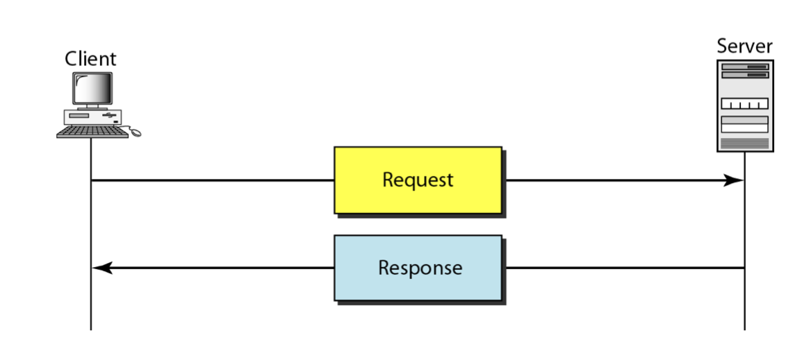

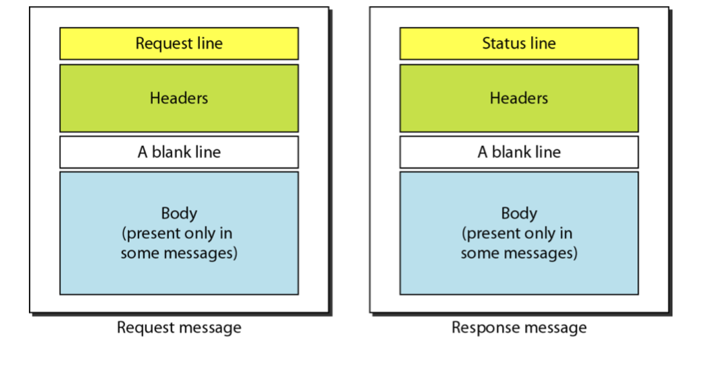

**องค์ประกอบของ message**

* Request type เป็นส่วนที่ใช้ในข้อความร้องขอนั้นๆ  ซึ่ง Request type ใน HTTP/1.1 
* HTTP version เวอร์ชันล่าสุดของ HTTP คือ 1.1
* Status code จะใช้ใน Response message  ซึ่ง Status code จะมีความคล้ายคลึ่งกับ FTP และ SMTP โพรโตคอล  โดยจะคำอธิบาย Status code ในรูปแบบของข้อความด้วย
* Status phrase ส่วนนี้จะใช้ใน Response message  ซึ่งอธิบาย Status code ในรูปแบบของข้อความ  

ตัวอย่าง GET Method

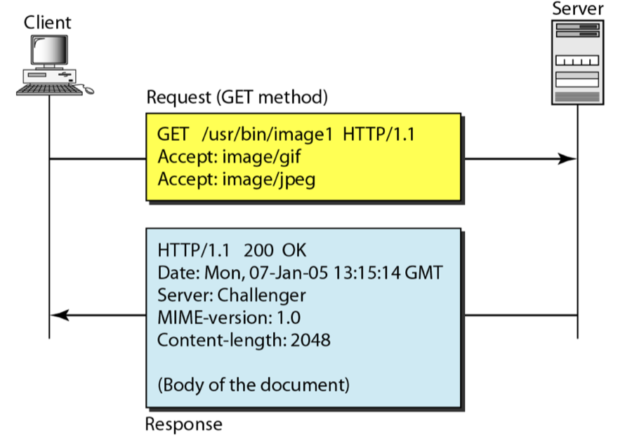

ตัวอย่าง POST Method

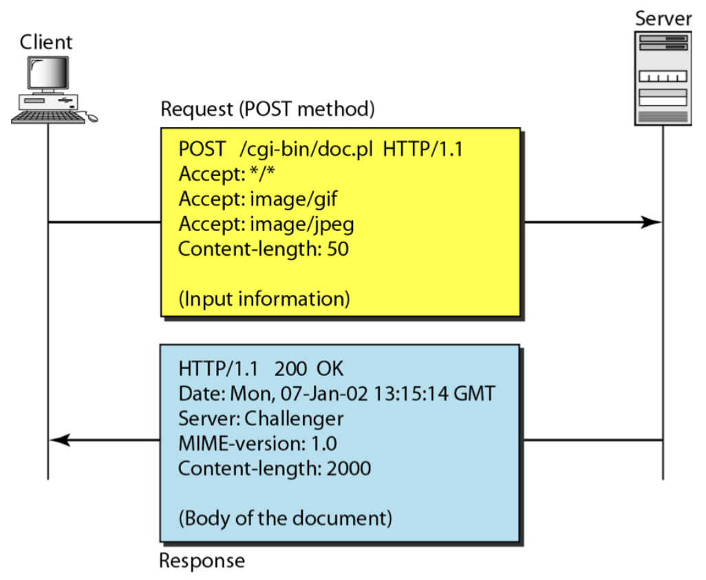

ตัวอย่างการทดลองการเชื่อมต่อโดยใช้โปรแกรม Telnet  ส่วนไคลเอนท์สามารถสื่อสารโดยตรงกับเซิร์ฟเวอร์ได้ โดยใช้ TELNET ซึ่งจะเข้าสู่ระบบ ผ่านทางพอร์ต 80

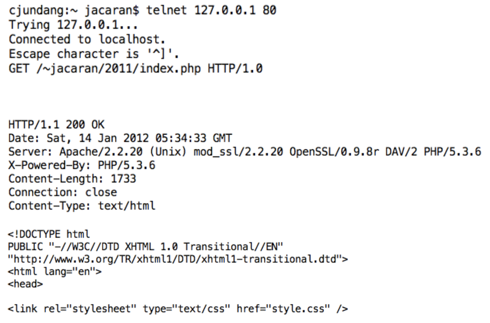

**WiFi and NodeMCU**

NodeMCU is an open-source firmware and development board based on the ESP8266 WiFi microcontroller. The ESP8266 has a built-in WiFi module, which allows NodeMCU to connect to WiFi networks and communicate with other devices over the internet.
* Connect To WiFi
```
const char* ssid = "ssid";
const char* password = "pass";

void wifi_init(){
  WiFi.begin(ssid, password);
  Serial.println("Connecting");
  while(WiFi.status() != WL_CONNECTED) {
    delay(500);
    Serial.print(".");
  }
  Serial.println("");
  Serial.print("Connected to WiFi network with IP Address: ");
  Serial.println(WiFi.localIP());
}

```
* Node MCU Server
```
#include <ESP8266WiFi.h>

WiFiServer server(8080);

void setup() {
  Serial.begin(9600);
  wifi_init();
  server.begin();
}

void loop() {
  WiFiClient client = server.available();
  if(!client)
    return;
  while( !client.available())
    delay(1);
  
  String msg = "10";
  client.println("HTTP/1.0 200 OK");
  client.println("Content-Type: text/html");
  client.println("");
  client.println(msg);
  delay(1);
}
```
* Webserver
```
#include <ESP8266WebServer.h>

ESP8266WebServer server(80);

void setup() {
  Serial.begin(9600);
  wifi_init();
  
  server.on(F("/"), []{
    server.send(200, "text/plain", "Hello from esp8266");
  });

  server.begin();
}

void loop(){
  server.handleClient();
}
```
* Uri Regular Expression

```
#include<uri/UriBrances.h>
server.on( UriBrances("/users/{}"), [](){
    String user = server.pathArg(0);
    server.send(200, "text/plain", "User: '" +user+"' ");
});

```

```
#include<uri/UriRegex.h>

server.on( UriBrances("^\\/users\\/([0-9]+)\\/devices\\/([0-9]+)$"), [](){
    String user = server.pathArg(0);
    String device = server.pathArg(1);

    server.send(200, "text/plain", "User: '" +user+"' and Devices: '" + devices+"'");
});

```

### IoT Server: Thingspeaks

**How to register Thingspeak**

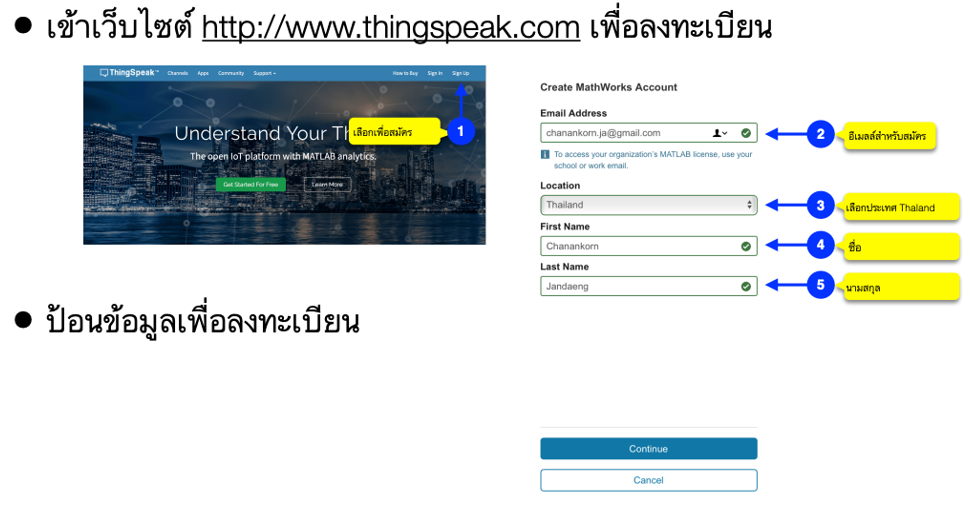

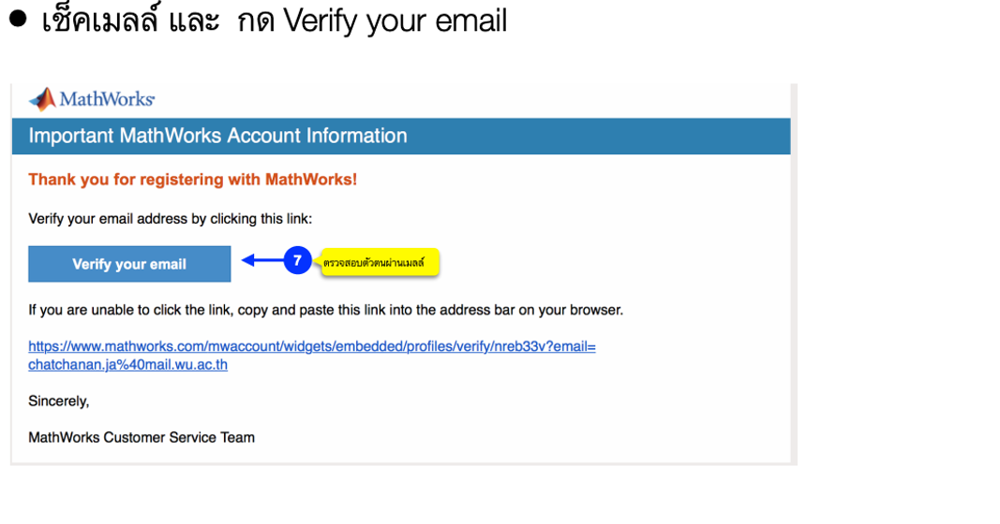

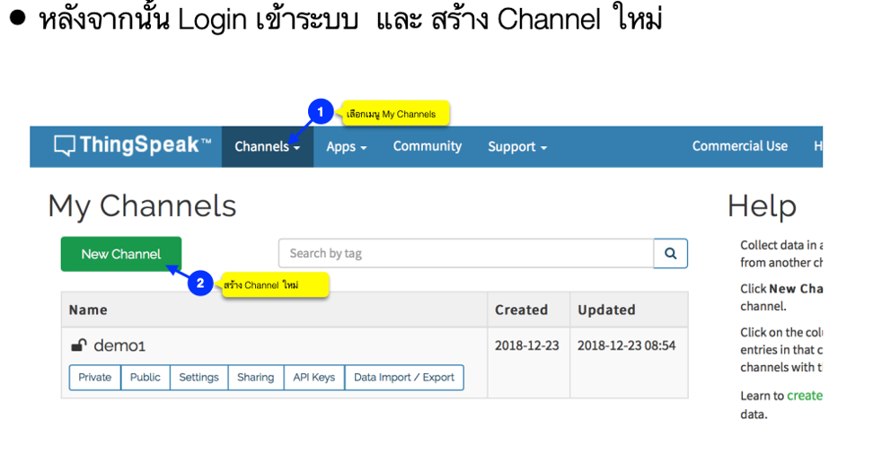

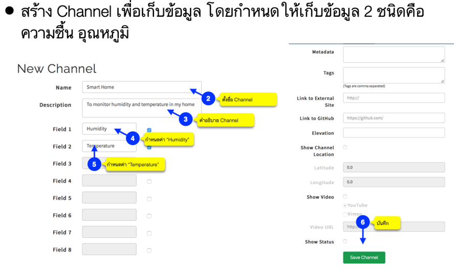

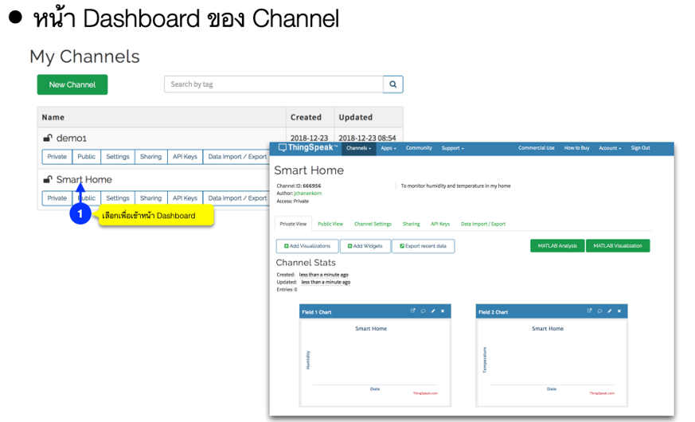

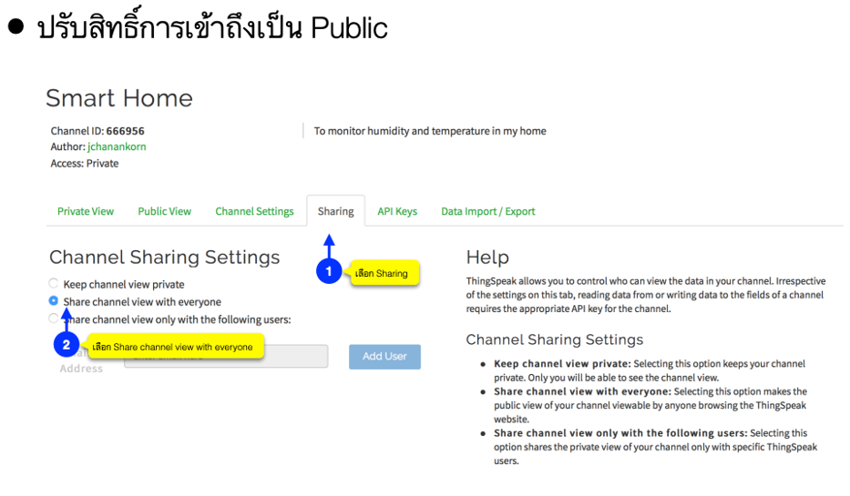

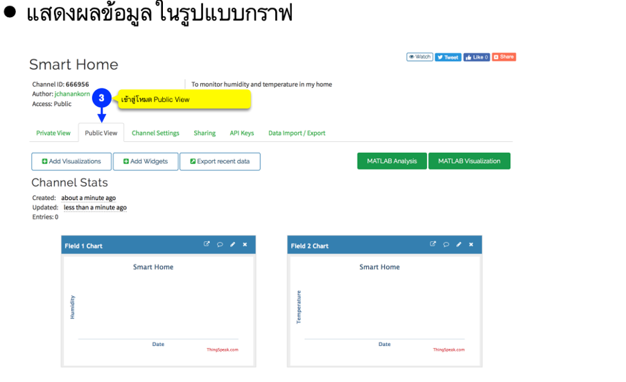

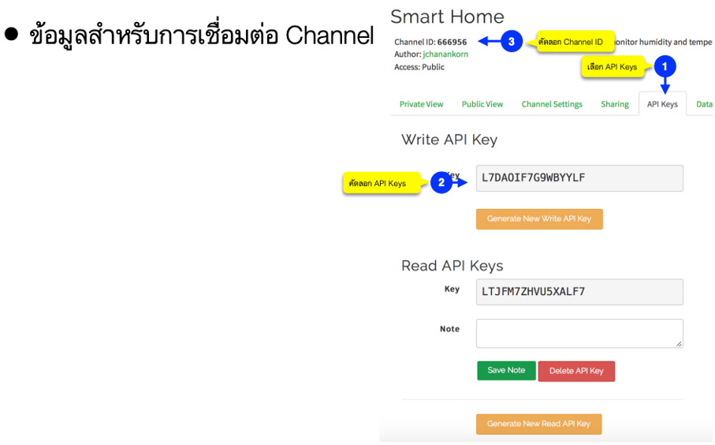

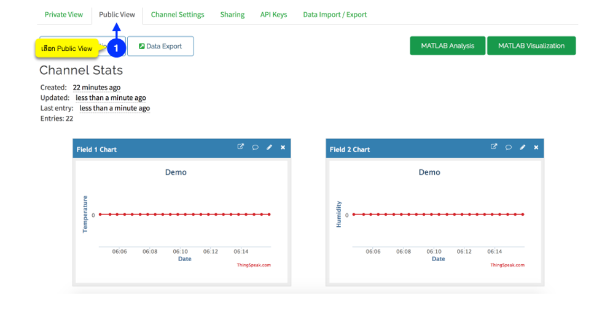


**NodeMCU connecting to Thingspeak**
- add thingspeak library to Arduino IDE, search "Thingspeak" by MathWorks

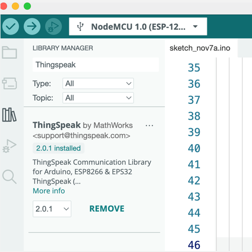

- The library includes several examples organized by board type to help you get started. These are accessible in Examples > ThingSpeak menu of the Arduino IDE
  - ReadField: Reading from a public channel and a private channel on ThingSpeak.
  - WriteSingleField: Writing a value to a single field on ThingSpeak.
  - WriteMultipleFields: Writing values to multiple fields and status in one transactio
  - ReadMultipleFields: Reading values from multiple fields, status, location, created-at timestamp from a public channel on ThingSpeak

more details from link <a href="https://github.com/mathworks/thingspeak-arduino">thingspeak-arduino</a>

- short example : 

**Preparations**
```
#include <ESP8266WiFi.h>
#include "ThingSpeak.h"

const char* ssid = "ssid";
const char* password = "pass";

unsigned long channelID = 1486243;
const char* writeKey = "KEY";

unsigned long lastTime = 0;
unsigned long timerDelay = 15000;

WiFiClient  client;
```
**Setup()**
```
void setup() {
  Serial.begin(115200);   
  WiFi.mode(WIFI_STA);   
  ThingSpeak.begin(client);   
}
```
**loop()**
```
void loop() {
  if ((millis() - lastTime) > timerDelay) {
```
try to connect to wireless
```
    if(WiFi.status() != WL_CONNECTED){
      Serial.print("Attempting to connect");
      while(WiFi.status() != WL_CONNECTED){
        WiFi.begin(ssid, password); 
        delay(5000);     
      } 
      Serial.println("\nConnected.");
    }
```
get data from sensor 
```
    int value = analogRead(A0);
    Serial.print("Value: ");
    Serial.println(value);
```
send single value to thingspeak
```
    int x = ThingSpeak.writeField(channelID, 2, value, writeKey);
```
validate the status, if x is 200, the connection is success.
```
    if(x == 200){
      Serial.println("Channel update successful.");
    }
    else{
      Serial.println("Problem updating channel. HTTP error code " + String(x));
    }
    lastTime = millis();
  }
}
```
download code
[here](/example/thingspeak_2.ino)

### IoT Server: JSON-Server
**Install JSON-server**
- download and install nodejs and npm
  - download nodejs from https://nodejs.org/en/download
- download and install json-server
```
npm install -g json-server
```
- official document of JSON-server from [here](https://www.npmjs.com/package/json-server)
- more example of JSON-server [here](https://devahoy.com/mock-api-with-json-server/)

**The experimental architecture**

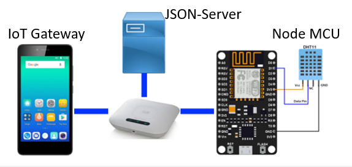

- create data.json
```
{
    "sensors": [
      { 
        "id": 0, 
        "title": "dht11", 
        "value": "0" 
        }
    ]
}
```
- start service
```
>json-server -H 0.0.0.0 --watch data.json

  \{^_^}/ hi!

  Loading data.json
  Done

  Resources
  http://0.0.0.0:3000/sensers

  Home
  http://0.0.0.0:3000

  Type s + enter at any time to create a snapshot of the database
  Watching...
```
- code
```
#include <ESP8266WiFi.h>
#include <ESP8266HTTPClient.h>
#include <WiFiClient.h>

const char* ssid = "ssid";
const char* password = "passwd";

const char* serverName = "http://192.168.204.29:3000/sensors";

unsigned long lastTime = 0;
unsigned long timerDelay = 5000;

WiFiClient  client;

```
setup function: try to connect to wifi
```
void setup() {
  Serial.begin(115200); 

  WiFi.begin(ssid, password);
  Serial.println("Connecting");
  while(WiFi.status() != WL_CONNECTED) {
    delay(500);
    Serial.print(".");
  }
  Serial.println("");
  Serial.print("Connected to WiFi network with IP Address: ");
  Serial.println(WiFi.localIP());
}
```
loop and delay for 5 second
```
void loop() {
  if ((millis() - lastTime) > timerDelay) {
    if(WiFi.status()== WL_CONNECTED){
      WiFiClient client;
      HTTPClient http;
      http.begin(client, serverName);
```
set data content-type is JSON  and prepar data and represent in JSON format
```
      http.addHeader("Content-Type", "application/json");
      int httpResponseCode = http.POST("{\"title\":\"dht11\", \"value\":11}");
      Serial.print("HTTP Response code: ");
      Serial.println(httpResponseCode);
      http.end();
    }
  else {
      Serial.println("WiFi Disconnected");
    }
    lastTime = millis();
  }
}
```
### MQTT

MQTT, which stands for Message Queuing Telemetry Transport, is a lightweight and open messaging protocol designed for small sensors and mobile devices with limited bandwidth and power. It was developed by IBM in the late 1990s and later became an open standard. MQTT is widely used in the Internet of Things (IoT) and other applications where low-latency and real-time communication are essential.

Here are some key characteristics of MQTT:

- Publish/Subscribe Model: MQTT uses a publish/subscribe messaging pattern. Devices, also known as clients, can publish messages to specific topics or subscribe to receive messages on specific topics.
- Broker: MQTT communication is facilitated through a central component called the broker. The broker is responsible for receiving messages from publishers and delivering them to subscribers based on the topic. It acts as an intermediary for message exchange.
- Topics: Messages are organized into topics, which are like channels or categories. Clients can subscribe to specific topics to receive messages related to those topics. Topics provide a way to categorize and filter messages.

- Lightweight: One of the key advantages of MQTT is its lightweight nature. The protocol is designed to be efficient in terms of bandwidth usage and is well-suited for resource-constrained devices and low-bandwidth, high-latency, or unreliable
networks.

- Security: While MQTT itself does not provide security features, it can be used in conjunction with other security mechanisms such as TLS/SSL for encryption and authentication.

**Example**

- initial the varaible
```
#include <ESP8266WiFi.h>
#include <PubSubClient.h>

const char* ssid = "SSID";
const char* password = "PASSWORD";
const char* mqtt_server = "IP ADDRESS";

WiFiClient espClient;
PubSubClient client(espClient);

```
- setup_wifi() to connect the WiFi access point
```
void setup_wifi() {
  delay(10);
  Serial.println();
  Serial.print("Connecting to ");
  Serial.println(ssid);

  WiFi.mode(WIFI_STA);
  WiFi.begin(ssid, password);

  while (WiFi.status() != WL_CONNECTED) {
    delay(500);
    Serial.print(".");
  }

  randomSeed(micros());

  Serial.println("");
  Serial.println("WiFi connected");
  Serial.println("IP address: ");
  Serial.println(WiFi.localIP());
}
```
- reconnect() try to connect to MQTT Broker
- publish value "hello word" to topic "dht11"  
```
void reconnect() {
  while (!client.connected()) {
    Serial.print("Attempting MQTT connection...");
    String clientId = "ESP8266Client-";
    clientId += String(random(0xffff), HEX);
    if (client.connect(clientId.c_str())) {
      Serial.println("connected");
      client.publish("dht11", "hello world");
    } else {
      Serial.print("failed, rc=");
      Serial.print(client.state());
      Serial.println(" try again in 5 seconds");
      delay(5000);
    }
  }
}
```
- setup() and loop() function
```
void setup() {
  pinMode(BUILTIN_LED, OUTPUT);     
  Serial.begin(115200);
  setup_wifi();
  client.setServer(mqtt_server, 1883);
}

void loop() {
  if (!client.connected()) {
    reconnect();
  }
  client.loop();
}
```
- the full example download [here](/example/mqtt_sub/mqtt_sub.ino)


### CoAP

- CoAP is widely used in various IoT applications
  - such as smart homes, industrial automation, smart cities, and sensor networks, 
  - where resource-constrained devices need an efficient and reliable communication protocol. 
- It offers a way to interact with IoT devices and sensors over constrained networks 
  - while minimizing the overhead associated with more traditional protocols like HTTP.
- Specialized web transfer protocol for constrained environments
- Designed for Internet of Things (IoT) applications
- Lightweight and efficient
- Ideal for resource-constrained devices and low-power networks
- Equivalent of HTTP for IoT and constrained devices


- Key features:
  - Lightweight: CoAP is designed to be efficient and lightweight. It uses a compact binary format for messages, reducing overhead and conserving resources.
  - RESTful: CoAP follows the principles of Representational State Transfer (REST), similar to HTTP. It uses methods like GET, POST, PUT, and DELETE to interact with resources identified by URIs (Uniform Resource Identifiers).
  - UDP-based: CoAP primarily uses the User Datagram Protocol (UDP) as its transport layer, which is well-suited for low-power and lossy networks. However, it can also run over other protocols like TCP or DTLS for secure communication.
  - Request-response model: CoAP employs a request-response model, similar to HTTP. Clients send requests to servers, which respond with appropriate responses. It also supports asynchronous communication for observing resources and receiving notifications when they change.
  - Resource discovery: CoAP includes a mechanism for resource discovery, allowing clients to discover available resources on a server by querying a ".well-known/core" resource.
  - CoAP options: CoAP messages can include options that provide additional information or metadata about the request or response. These options are similar to HTTP headers but are designed to be more compact.
  - Security: CoAP can be secured using the Datagram Transport Layer Security (DTLS) protocol, which provides authentication and encryption for communication.
  -Proxying: CoAP supports proxy servers, allowing clients to access resources on remote servers through a proxy, similar to how HTTP proxies work.
  - Multicast support: CoAP supports IP multicast, making it suitable for applications that require group communication.


